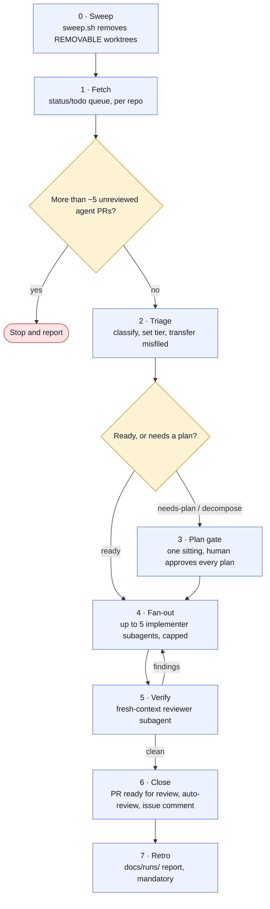
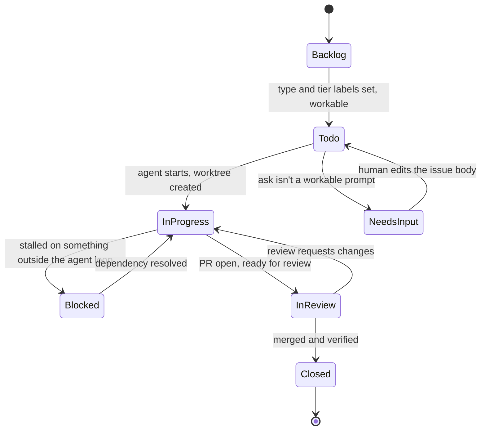

# Nightshift

Nightshift is the working environment that drains a queue of GitHub issues
filed against **other people's repositories** into reviewed, ready-for-review
pull requests — one command, GitHub Issues as the system of record from end
to end.

[](https://github.com/blaine-hiers/Nightshift/actions/workflows/ci.yml)
[](LICENSE)
[](tests/sweep_test.sh)

Nightshift is not a library. It is the main working environment for doing
tracked work — investigating and fixing issues, and running projects — in
**other** repositories, without babysitting them. The repo tracks the
workflow and never the code being worked on: target repos are cloned into a
gitignored `workspace/`, and every issue gets its own worktree.

## How the queue drains

The `queue-drain` skill (`.claude/skills/queue-drain/SKILL.md`) is the batch
pipeline. It fans tickets out to implementer subagents capped at 5
concurrent, and every diff gets a fresh-context reviewer before a PR opens.



Two human gates only: the batched plan approval at stage 3, and the PR merge
outside this pipeline entirely. Everything else runs unattended, and the
run is not done until the mandatory retro (stage 7) is written to
`docs/runs/`.

## Issue status model

GitHub Issues only have open and closed, so Nightshift carries the rest of
the state in an exclusive `status/…` label. `status/needs-input` and
`status/blocked` are off-ramps, not stops — they exist so a stalled issue
never sits somewhere that lies about its state.



States map onto the labels from `CLAUDE.md`: `Backlog` = `status/backlog`,
`Todo` = `status/todo`, `InProgress` = `status/in-progress`, `NeedsInput` =
`status/needs-input`, `Blocked` = `status/blocked`, `InReview` =
`status/in-review`, and `Closed` is the issue closed on GitHub (merged and
verified — closing as "not planned" or a duplicate are also closes, just
not driven by this loop).

## Why it is safe to leave running

Autonomous agent pipelines fail in predictable ways. Most of the design here is
a response to one of them.

### The plan gate is batched, not per-ticket

Every ticket's plan is approved in a single pass before any of them start. A bad
batch gets stopped once instead of five times, and the human doing the approving
sees the whole shape of the work rather than five decontextualised plans
arriving over twenty minutes.

### Verification uses fresh context

The agent that checks the work is never the agent that did it.

**A model that has just argued itself into a fix is the worst possible reviewer
of that fix.** It has spent its whole context justifying the approach, and
asking it to find the flaw is asking it to contradict its own reasoning. A
reviewer that never saw the original session has no such investment.

### Fan-out is capped

Five concurrent tickets, hard. Not because five is magic, but because an
unbounded fan-out turns a bad plan into a bad plan applied everywhere before
anyone notices.

### Stalled work leaves the queue

One rule carries the status model (see the diagram above):

> **`status/todo` means an agent can start right now with zero questions.**

Anything that would make an agent stop and ask goes to `status/needs-input`.
Anything waiting on a vendor, a credential, or a human decision goes to
`status/blocked`.

A stalled ticket left in `status/in-progress` makes "what is active"
meaningless. Left in `status/todo` it gets re-queued into the next drain, which
spends a fresh agent rediscovering the same blocker. Both off-ramps require a
comment naming what is being waited on and who owns it, or the status change is
just a shrug.

## Cost discipline

Every ticket carries a tier label, set once at triage so the drain reads a
decision instead of re-deriving one on every pass. The rule is **default down,
not up**:

| Tier | Use for |
|---|---|
| `haiku` | Mechanical and well specified: doc drift, renames, a missing guard, a one-line fix |
| `sonnet` | Ordinary bugfixes: reproduce, trace, patch, run tests. The normal default |
| `opus` | Unclear root cause, cross-cutting refactor, concurrency or security reasoning, or after a lower tier has visibly failed |
| `codex` | Routed through `codex-dispatch` |

Escalation happens when a cheaper tier visibly fails, not in anticipation that
it might. Per-tier ticket budgets cap what a single drain can spend, so a
runaway loop is a bounded loss rather than an invoice.

## Cross-model review

`codex-dispatch` works a `tier/codex` ticket with Codex as the implementer in a
sandboxed worktree and Claude as coordinator and reviewer. Codex reviews the
diff first, read-only and fresh, then the Claude reviewer runs as the gating
verdict, with one fix round per review stage.

Two different models disagreeing about a diff surfaces problems neither catches
alone. The gate deliberately stays with one of them, because review by consensus
between two models that cannot break a tie is review that deadlocks.

## Supply chain

`.claude/skills/` holds the workflow. Two are first-party: `queue-drain` (the
pipeline above) and `codex-dispatch` (the cross-model path).

The other fourteen are third-party imports from Trail of Bits, Anthropic,
mattpocock, vercel-labs, spillwavesolutions and skills-directory. Provenance and
licences are recorded in `docs/skills.md` and pinned in `skills-lock.json`.

**Every third-party skill is read file by file before installation.** Anything
with external network calls, credential access, obfuscated code, or instructions
that override user intent is rejected rather than sandboxed. A skill is
instructions handed directly to a model with tool access, which makes an
unreviewed one closer to an unreviewed dependency with shell access than to a
config file.

## Layout

```
.claude/skills/    the workflow, as skills
docs/workspace.md  worktree lifecycle and teardown rules
docs/skills.md     skill inventory with provenance
docs/pipeline.html flowchart of the whole workflow
docs/templates/    "how this app works" doc template, one per target repo
docs/superpowers/  plans, specs and research behind the pipeline
docs/runs/         run reports
workspace/         cloned target repos (gitignored, never tracked)
.env.example       env schema, names only; values live in Doppler
tests/             sweep tests
```

### Running the tests

```bash
bash tests/sweep_test.sh
```

## License

MIT for the first-party work here: the `queue-drain` and `codex-dispatch`
skills, the docs, and the sweep tests.

The fourteen third-party skills vendored under `.claude/skills/` keep their own
licenses and each carries its own license file. The Trail of Bits skills are
**CC BY-SA 4.0**, not MIT, and share-alike follows any adapted copy. `NOTICE`
has the details and `docs/skills.md` has the provenance.
